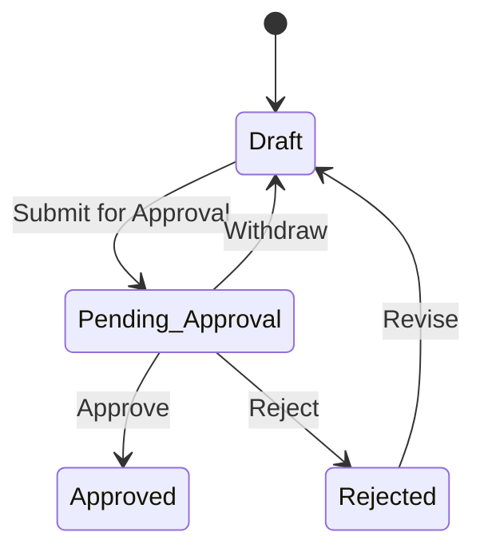

## Workflow Purchase Requests (Next.js)

Modern purchase request workflow application built with Next.js 14 (App Router), TypeScript, Tailwind CSS, and shadcn/ui. It models a pragmatic approval process using a finite state machine and provides a clean UI to create, review, and advance requests.

### Business Overview (Finite State Machine)

The core business flow is expressed as a small, explicit finite state machine (FSM) to guarantee valid transitions and auditable history.

- **States**: Draft → Pending Approval → Approved | Rejected
- **Actions**:
  - Draft → Pending Approval: "Submit for Approval"
  - Pending Approval → Approved: "Approve"
  - Pending Approval → Rejected: "Reject"
  - Pending Approval → Draft: "Withdraw"
  - Rejected → Draft: "Revise"

Transitions are declared in `lib/types.ts` as `WORKFLOW_TRANSITIONS`, and validated by `getValidTransitions(currentStatus)`. Enforcement happens in `useRequestStore.changeStatus(...)` to prevent illegal state changes, and each change is appended to the request `history` for traceability.

Mermaid diagram of the FSM:



Key business guarantees:
- Only declared transitions are allowed (no implicit jumps between states).
- Every mutation creates an auditable `history` entry (actor, action, timestamp, optional comment).
- Requests can be revised after rejection and resubmitted.

### Technical Overview

- **Framework**: Next.js 14 (App Router) with React 18 and TypeScript
- **Styling**: Tailwind CSS + tailwindcss-animate
- **UI Kit**: shadcn/ui (Radix UI primitives) and lucide-react icons
- **State Management**: Zustand stores for requests and material catalog
- **Utilities**: date-fns, uuid, clsx/cva

Architecture highlights:
- `app/` uses the App Router for pages and routing (e.g., `app/requests`, dynamic routes for edit/view).
- `store/requestStore.ts` contains request CRUD, status transitions, and consistent mock data generation for a rich demo without a backend.
- `store/materialStore.ts` provides a filterable material catalog used by the Items table selector.
- `components/workflow/WorkflowModal.tsx` renders the actionable workflow view, surfacing valid transitions returned by `getValidTransitions` and writing back to the store.
- `components/RequestForm.tsx`, `components/ItemsTable.tsx`, and `components/MaterialSelector.tsx` compose the main creation/edit experience.

Selected files:
- `lib/types.ts`: Types, `RequestStatus`, `WORKFLOW_TRANSITIONS`, `getValidTransitions`.
- `store/requestStore.ts`: Authoritative transition enforcement in `changeStatus` with history logging.
- `components/workflow/WorkflowModal.tsx`: Shows current status, valid actions, activity/notes/files tabs.

### Project Structure

```
app/
  requests/
    [id]/edit/page.tsx
    [id]/view/page.tsx
    new/page.tsx
    page.tsx
components/
  ItemsTable.tsx
  MaterialSelector.tsx
  RequestForm.tsx
  RequestTable.tsx
  workflow/WorkflowModal.tsx
  ui/ ... (shadcn/ui components)
lib/
  types.ts
store/
  requestStore.ts
  materialStore.ts
```

### Getting Started

Prerequisites:
- Node.js 18+
- npm 9+

Install dependencies:
```bash
npm install
```

Run in development mode:
```bash
npm run dev
```

Build for production:
```bash
npm run build
```

Start the production server (after build):
```bash
npm start
```

Available scripts (see `package.json`):
- `dev`: Start Next.js in development
- `build`: Create production build
- `start`: Run the production server
- `lint`: Run Next.js ESLint

### Data and State

- The app uses deterministic mock data for requests and materials to provide a stable, realistic demo without a backend.
- `requestStore.ts` bootstraps a large, repeatable dataset and appends history entries on each mutation.
- `materialStore.ts` generates a catalog with categories/subcategories and exposes a filter for the selector dialog.

### CI/CD and Deployment (Netlify)

This project is configured for Netlify deployments using the official Next.js plugin.

Netlify configuration (`netlify.toml`):
- Build command: `npm run build`
- Publish directory: `.next`
- Node runtime: `NODE_VERSION=18`
- Plugin: `@netlify/plugin-nextjs`

Deploy options:
1) Connect the Git repository to Netlify
- Netlify will auto-detect Next.js and use the provided `netlify.toml`.
- Ensure the Node version is 18 in the build environment (already specified).

2) Manual via CLI (optional)
```bash
# If not installed
npm install -g netlify-cli

# Login and link
netlify login
netlify init

# Build and deploy a production build
npm run build
netlify deploy --build --prod
```

Post-deploy:
- The Next.js plugin handles serverless functions and routing for the App Router.
- If environment variables are needed later, define them in Netlify UI under Site settings → Build & deploy → Environment.

### Security and Quality

- TypeScript across the codebase for safer refactors.
- ESLint with Next.js rules (`npm run lint`).
- No external backend or secrets are required by default. Add environment variables only when integrating external APIs.

### Contributing

1. Create a feature branch.
2. Write clear commit messages (e.g., "feat: add X", "fix: correct Y").
3. Ensure `npm run build` and `npm run lint` pass.
4. Open a PR with a concise, context-rich description.

---

If you have questions or need guidance on extending the FSM (e.g., additional states like "On Hold" or multi-step approvals), see `lib/types.ts` and `useRequestStore.changeStatus` as the authoritative places to add transitions and guards.


